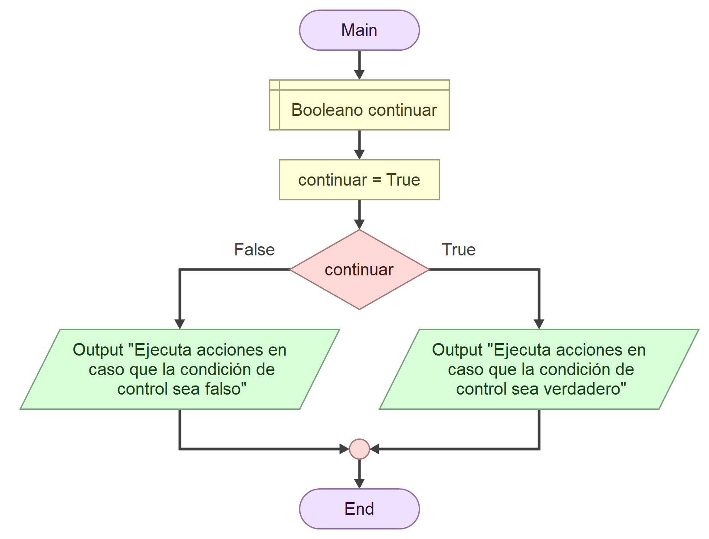

# **Álgebra Booleana: Las matemáticas de las verdad**

## **Álgebra Booleana: El Cerebro de la Automatización**

El álgebra booleana no es solo un ejercicio matemático; es el lenguaje fundamental para **diseñar soluciones**. Antes de escribir una sola línea de código, un profesional en ingeniería debe ser capaz de expresar las condiciones del problema en lógica formal. Esto permite simplificar procesos complejos y eliminar ambigüedades.

### **Operadores Lógicos**

#### **AND (Y) - Conjunción**

- **Lógica:** "Todo debe ser verdad".

- **Tabla:** V y V = **V**. Cualquier otra combinación es F.

- **Uso:** Seguridad estricta. Una prensa solo baja `SI` (Sensor Barrera Libre `AND` Botones Presionados).

| Entrada 1 | Entrada 2 | Resultado |
| :-------: | :-------: | :-------: |
|     F     |     F     |     F     |
|     F     |     V     |     F     |
|     V     |     F     |     F     |
|     V     |     V     |     V     |

#### **OR (O) - Disyunción**

- **Lógica:** "Basta con una verdad".

- **Tabla:** F o F = **F**. Cualquier otra combinación es V.

- **Uso:** Redundancia o alertas. Activar aspersores `SI` (Sensor Humo Sala A `OR` Sensor Humo Sala B).

| Entrada 1 | Entrada 2 | Resultado |
| :-------: | :-------: | :-------: |
|     F     |     F     |     F     |
|     F     |     V     |     V     |
|     V     |     F     |     V     |
|     V     |     V     |     V     |

#### **NOT (NO) - Negación**

- **Lógica:** Inversión.

- **Uso:** Lógica inversa. `SI NOT Parada_Emergencia` (Si la parada NO está activada, entonces opere).

| Entrada | Resultado |
| :-----: | :-------: |
|    F    |     V     |
|    V    |     F     |

#### **Visualizando la Lógica: De Booleanos a Diagramas**

Hasta ahora hemos visto fórmulas como (A AND B). Pero en la planta, los procesos se visualizan. Debemos aprender a traducir estos operadores lógicos a **Diagramas de Flujo**, utilizando el símbolo de Decisión (Rombo).

  Ejemplo de cómo se visualiza la decisión en Flowgorithm

Recordemos que un rombo siempre tiene una entrada y dos salidas (SÍ y NO). ¿Cómo dibujamos lógicas complejas?, a continuación lo veremos:

**Representación Gráfica del AND**

El operador AND implica una obligación estricta: _Ambas condiciones deben cumplirse_.

- **En Diagrama:** Se dibuja con un rombo y dentro de este el operador AND.

- **Flujo:**

  1. Entra al Rombo de la Condición 1.

  2. Si es **NO** → El proceso se detiene o va a la ruta de rechazo.

  3. Si es **SÍ** → Pasa inmediatamente al Rombo de la Condición 2.

  4. Si la Condición 2 también es **SÍ** → Se ejecuta la Acción.

- **Ejemplo**_:_ Queremos ir de fiesta con un amigo nuevo de la U, pero no sabemos la edad y si tiene dinero, para que pueda ir de fiesta tiene que cumplir al mismo tiempo dos condiciones, que sea mayor de edad y tener al menos 5000 colones. Por lo que le preguntamos ambos valores y los evaluamos con una condición, y los elementos de la condición usan el operador AND. Si falla en cualquiera de las dos condiciones, no puede ir con nosotros a la “Cali”.

Una presentación del ejemplo en diagrama de flujos

********

**Representación Gráfica del OR**

El operador OR implica flexibilidad: _Basta con una_.

- **En Diagrama:** Se dibuja con un rombo y dentro de este el operador OR.

- **Flujo:**

  1. Entra al Rombo de la Condición 1.

  2. Si es **SÍ** → Va directo a la Acción (¡Éxito!).

  3. Si es **NO** → En lugar de rechazar, le damos una segunda oportunidad: pasa al Rombo de la Condición 2.

  4. Si la Condición 2 es **SÍ** → Va a la Acción.

- **Ejemplo**_:_ Mi familia (mi papá, mi mamá y yo) vamos a pasear a Orlando, y queremos ingresar a los nuevos salones VIP familiares del aeropuerto, pero estos salones ocupan cupones especiales de ingreso de familias, cada cupón permite hasta 4 personas. Mi mamá tiene la tarjeta Mastercard Black y mi papá tiene la Visa Infinite, a mi mamá le dan 3 cupones por año y a mi papá 2 por semestre. Por lo que necesitamos que alguna de las tarjetas tenga al menos un cupón familiar para ingresar.

Ejemplo anterior, ingresado con Mastercard

Ejemplo anterior, ingresado con Visa

**Representación Gráfica del NOT (Inversión)**

Es simplemente cambiar el resultado de la operación booleana. Lo que usualmente sería el camino del "SÍ", ahora es el camino de lo que queremos evitar.

El operador NOT implica inversión al resultado: _Basta con dar “vuelta” al resultado_.

- **En Diagrama:** Se dibuja con un rombo y dentro de este el operador NOT.

- **Ejemplo**_:_ La CCSS a veces tiene restricciones de ingreso a los hospitales, si hay alerta por virus obligan a las personas que ingresan a las instalaciones a portar una mascarilla. En caso que no haya alerta, pueden ingresar sin restricciones. Acá es donde por la naturales del significado del nombre de la variable, resulta que cuando es falso es cuando queremos ejecuta la condición “ideal”, sin mascarilla, pero a nivel de decisión queda invertido, por lo que se convierte en un caso de inversión.

Ejemplo del uso del not, dónde si NO HAY ALERTA, ingresa sin mascárilla

#### **Actividad Práctica Visual: Diagramando el Arranque del Motor**

Utilizando Flowgorithm, puedo expresar nuestras ideas utilizando los símbolos siguientes:

**Lógica:** (Voltaje OK \[A] AND Temperatura OK \[B]) AND (NOT Parada Emergencia \[C])

**Instrucciones para dibujar el Diagrama de Flujo:**

1. **Inicio:** Óvalo "Inicio".

2. **Lectura:** Paralelogramo "Leer Sensores A, B, C".

3. **Primera Decisión (AND):** Dibuje un Rombo "¿Voltaje Correcto?".

   - Salida **NO**: Flecha hacia Óvalo "Alerta: Error Voltaje" → Fin.

   - Salida **SÍ**: Flecha hacia el siguiente Rombo.

4. **Segunda Decisión (AND):** Rombo "¿Temperatura Segura?".

   - Salida **NO**: Flecha hacia Óvalo "Alerta: Sobrecalentamiento" → Fin.

   - Salida **SÍ**: Flecha hacia el siguiente Rombo.

5. **Tercera Decisión (NOT):** Rombo "¿Parada Emergencia Activada?".

   - _Cuidado aquí con la lógica inversa:_

   - Salida **SÍ** (Está activada): Flecha hacia "Motor Detenido por Seguridad".

   - Salida **NO** (No está activada, todo libre): Flecha hacia Rectángulo "ARRANCAR MOTOR".

6. **Fin:** Todas las rutas deben cerrar en un Óvalo de "Fin".

**Reflexión:** Note cómo la operación matemática A AND B AND NOT C se convirtió en un camino lineal de tres obstáculos que el flujo debe superar para llegar al éxito.

## **Actividad Práctica: Semana 3**

**Caso de Estudio: Sistema de Tarifas Eléctricas Industriales**

**Contexto:**

Como ingeniero en una planta, debes calcular el costo de la electricidad basado en el consumo y el horario, para decidir si encender las máquinas de alto consumo.

**Tarifas:**

1. Si el consumo es menor a 1000 kWh, la tarifa es **Baja**.

2. Si el consumo es mayor o igual a 1000 kWh:

   - Y el horario es "Pico" (Día), la tarifa es **Penalizada** (Muy Alta).

   - Y el horario es "Valle" (Noche), la tarifa es **Normal**.

**Ejercicio:**

1. **Variables:** Defina las variables necesarias y sus tipos (ej. Consumo\_Actual como Float, Es\_Horario\_Pico como Bool).

2. **Lógica:** Escriba el pseudocódigo utilizando una estructura anidada (If dentro de Else).

3. **Optimización:** Reescriba la condición para detectar la tarifa "Penalizada" en una sola línea usando operadores lógicos (AND).
