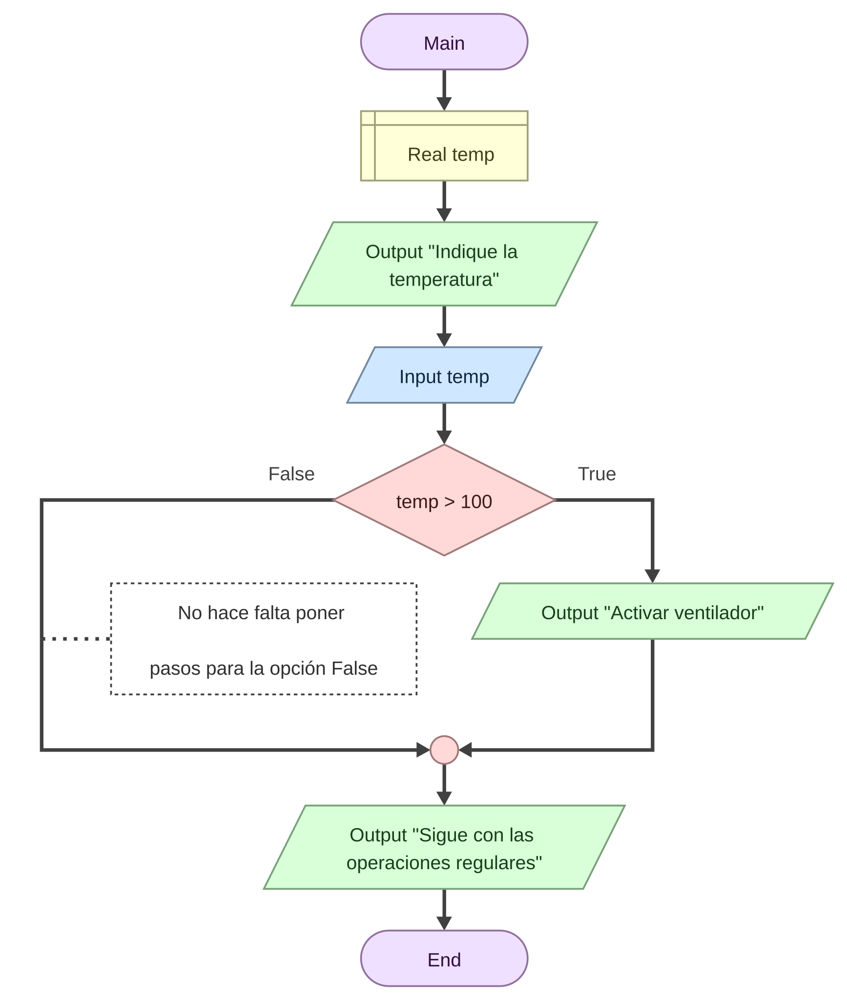
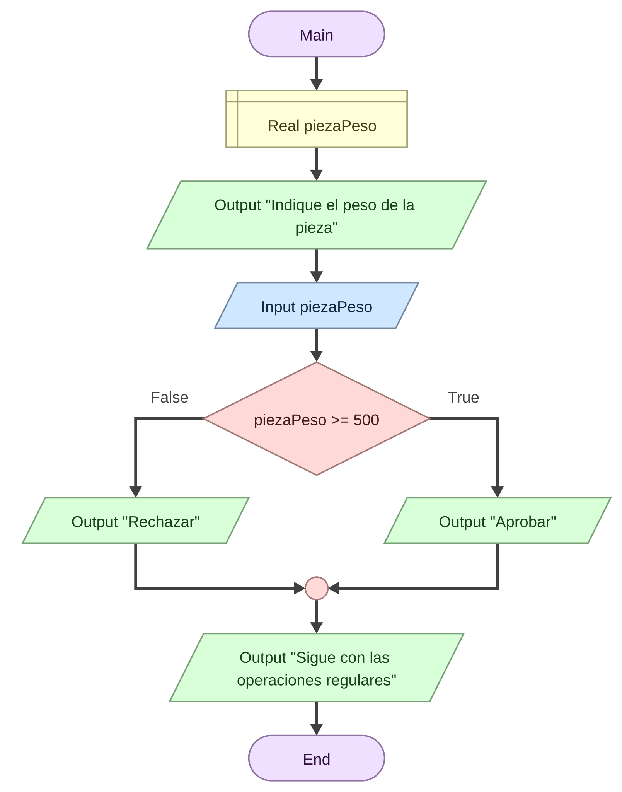
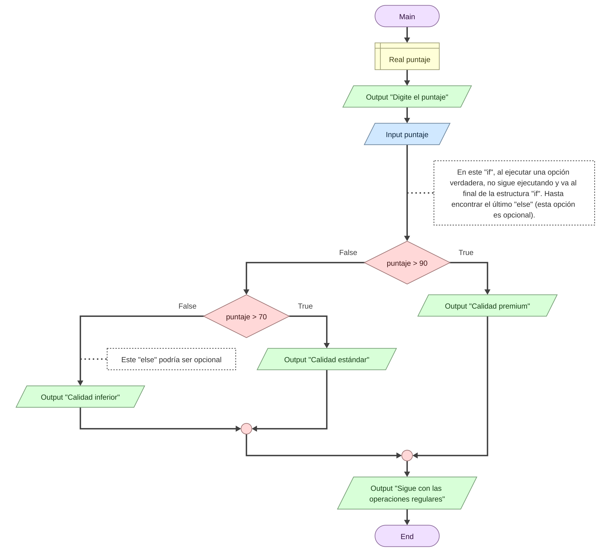
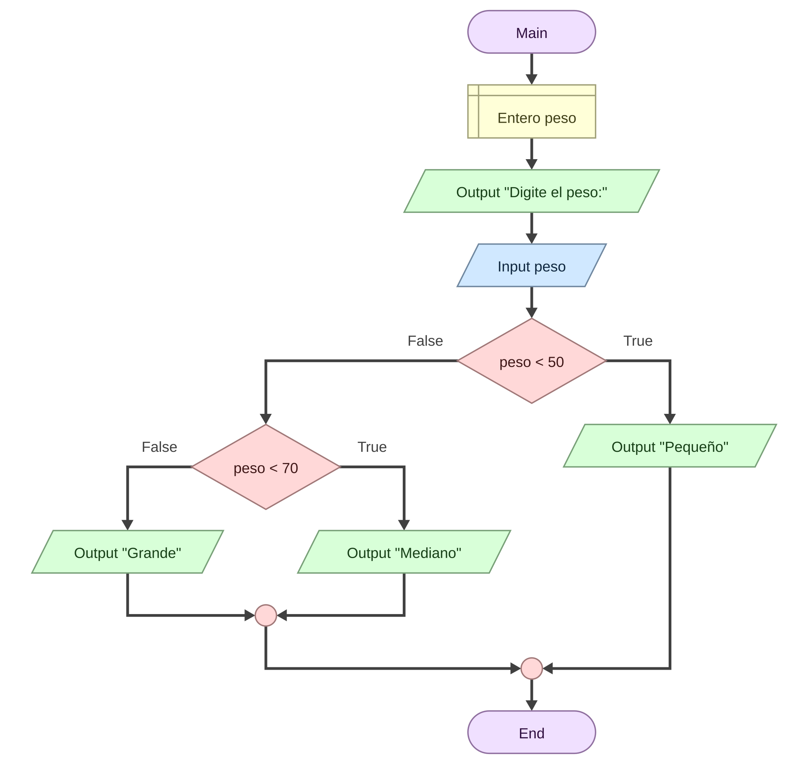

# **El Flujo de Control - Enseñando a la Máquina a Decidir**


## **Introducción: Rompiendo la Línea Recta**

Hasta ahora, nuestros algoritmos han sido **secuenciales**: una línea recta donde el Paso 1 lleva al Paso 2, y este al Paso 3.

``` Ejemplo Secuencial: Leer sensor → Sumar 10 → Guardar dato ```

Pero el mundo real no es una línea recta; es un árbol de decisiones. En una planta industrial, no tratamos igual a una pieza defectuosa que a una correcta.

En esta semana aprenderemos las **Estructuras de control condicionales**. Estos son los "desvíos" en las vías del tren que permiten al programa elegir un camino u otro basándose en las reglas de Álgebra booleana que aprendimos en las pasadas clases.


## **Conceptos Clave**

- **Flujo de Control:** El orden en el que se ejecutan las instrucciones de un programa.

- **Sentencia Condicional (If):** Instrucción que evalúa una expresión booleana (Verdadera/Falsa). Si es True, permite entrar a un bloque de código; si es False, lo salta.

- **Bloque de Código:** Grupo de instrucciones que pertenecen a una misma sección lógica (ej. todo lo que ocurre _dentro_ de una decisión).

- **Indentación (Sangría):** Espacio visual al inicio de una línea de código. En Python, **es obligatoria** y define qué instrucciones están "dentro" de una estructura de control.

- **Anidamiento (Nesting):** Colocar una estructura de control dentro de otra (una decisión dentro de otra decisión).

- **Código Espagueti:** Término peyorativo para programas con tantas decisiones anidadas y desordenadas que su flujo es imposible de seguir (como un plato de espagueti).


## **La Estructura Condicional (La Bifurcación)**

En programación**,** la toma de decisiones se maneja con la sentencia **IF** (Si...). Dependiendo de la complejidad, tenemos tres variantes:


#### **Condicional Simple (If)**

Evalúa una condición. Si es verdadera, ejecuta una acción. Si es falsa, no hace nada y sigue su camino.

```Sintaxis Lógica: Si (Temperatura > 100) Entonces: Activar_Ventilador. ```

```Analogía Industrial: Una barrera de seguridad. Si detecta movimiento, se detiene. Si no, sigue operando.```
 



#### **Condicional Doble (If - Else)**

Ofrece dos caminos mutuamente excluyentes. Si la condición es verdadera, toma el camino A; si es falsa, toma el camino B (Else significa "Si no" o "De lo contrario").

- _Sintaxis Lógica:_

  - Si (Pieza\_Peso >= 500) Entonces: Aprobar.

  - Si No (Else): Rechazar.

- _Analogía Industrial:_ Una válvula de tres vías. El fluido va hacia la izquierda o hacia la derecha. Nunca a ambos lados, nunca a ninguno.



#### **Condicional Múltiple (If - Elif - Else)**

Cuando tenemos más de dos opciones. Se evalúan condiciones en cascada.

- _Caso:_ Clasificación de Calidad.

  1. Si (Puntaje > 90) → Calidad **Premium**.

  2. Si No, pero (Puntaje > 70) → Calidad **Estándar**.

  3. Si No (Ninguna anterior) → **Chatarra**.

- _Nota:_ En Python usamos elif (abreviación de "Else If"). La computadora revisa la primera; si cumple, ignora el resto. Si no, baja a la segunda, y así sucesivamente.

- En **diagramas de flujo**, utilizamos un **estilo de diagramación** llamado **anidación por la izquierda**, donde en la opción False (izquierda) se evalúan las opciones siguientes, y la opción derecha (True) ejecuta y sale de la estructura.




## **La Importancia Vital de la Indentación**

Este es un punto crítico para aprender Python. En otros lenguajes (como C++ o Java), se usan llaves { } para agrupar instrucciones. **En Python, se usan los espacios en blanco (Indentación).**

- **Regla:** Todo lo que esté "empujado" hacia la derecha pertenece a la línea superior que termina en dos puntos (:).


#### **Ejemplo Visual (Pseudocódigo)**

Plaintext

SI (Sensor\_Activo == Verdadero):

    |--> Encender\_Luz       (Está DENTRO del SI)

    |--> Registrar\_Hora     (Está DENTRO del SI)

Sonido\_Alarma               (Está FUERA del SI, se ejecuta siempre)

```
🔗⚙️💻🐍Instalación de  Python y VS Code
```


#### **Código en Python (para versiones 3.10 en adelante)**

```Python
# cap04_ejemplo01.py
## Este ejemplo asume que usa Python 3.10 o superior que utiliza typing.

## Definición de variables
pieza_peso:float = 0.0
mensaje:str = ''

## Input
pieza_peso = float(input('Indique el peso de la pieza: '))

## Process
if pieza_peso >= 500:
    mensaje = 'Aprobada'
else:
    mensaje = 'Rechazada'

## Output
print('La pieza fue ' + mensaje)
```


#### **Código en Python (para versiones anteriores de 3.10)**

```Python
# cap04_ejemplo02.py
## Este ejemplo asume que usa Python algo antiguo.

## Definición de variables
pieza_peso = 0.0
mensaje = ''

## Input
pieza_peso = float(input('Indique el peso de la pieza: '))

## Process
if pieza_peso >= 500:
    mensaje = 'Aprobada'
else:
    mensaje = 'Rechazada'

## Output
print('La pieza fue ' + mensaje)
```

**Alerta para el Estudiante:** Si olvidas la indentación, Python te dará un error o, peor aún, ejecutará la lógica incorrectamente. Es como escribir un párrafo sin puntos aparte; se pierde el sentido de jerarquía.


## **Decisiones Anidadas y el Peligro del "Código Espagueti"**

Podemos poner un If dentro de otro If. Esto se llama **Anidamiento**.

- _Ejemplo:_

  - Si (Máquina Encendida):

    - Si (Nivel Aceite Bajo): → Alerta Aceite.

    - Si No: → Operación Normal.

Aunque es útil, abusar de esto es peligroso.

- **Regla de Diseño:** Si tienes que anidar más de 3 niveles de profundidad (un If dentro de un If dentro de un If...), probablemente tu diseño lógico está mal planteado, evalúa si se puede replantear con operadores AND/OR.

- **Solución:** Usar operadores lógicos (AND/OR) de la Semana 2 para simplificar.

  - _En vez de anidar:_ Si A: Si B: Acción

  - _Mejor usar:_ Si (A AND B): Acción


## **Aplicación con Diagramas de Flujo (DFD)**

Los DFD se vuelven más ramificados.


#### **Ejercicio Visual: El Clasificador de Huevos**

Imagina un sistema que clasifica huevos por peso para empacarlos.

- **Reglas:**

  - Peso < 50g: Pequeño.

  - 50g <= Peso < 70g: Mediano.

  - Peso >= 70g: Grande.

**¿Cómo se dibuja? (Estructura en Cascada)**

1. **Inicio**

2. **Lectura:** Leer Peso.

3. **Decisión 1:** ¿Peso < 50?

   - **SÍ:** Proceso "Marcar Pequeño" → Ir a Fin.

   - **NO:** (Bajamos por el camino del NO hacia otra decisión).

4. **Decisión 2:** ¿Peso < 70?

   - **SÍ:** Proceso "Marcar Mediano" (Ya sabemos que es >= 50 porque venimos del NO anterior) → Ir a Fin.

   - **NO:** Proceso "Marcar Grande" (Por descarte es >= 70).

5. **Fin.**



Este diagrama visualiza perfectamente la estructura If - Elif - Else.

Este tipo de estructura se le conoce también como anidamiento a la izquierda, ya que si la condición no se cumple, se evalúa con otra evaluación. Al momento de cumplir una condición, ejecuta y sale de la estructura. Si en la última condición se coloca una opción en el False , sería la opción que “captura” todas las condiciones no establecidas (como decir, “para todo lo demás” ejecute esto).

